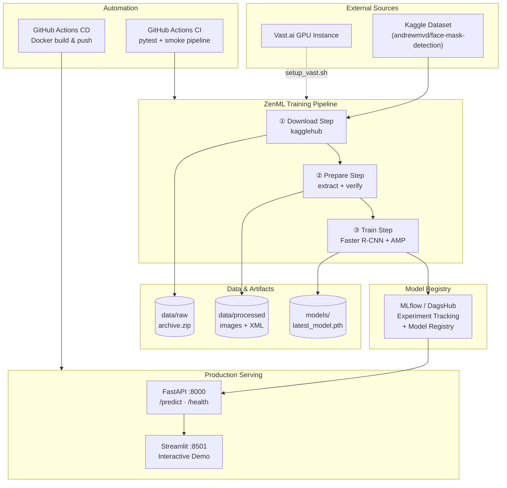
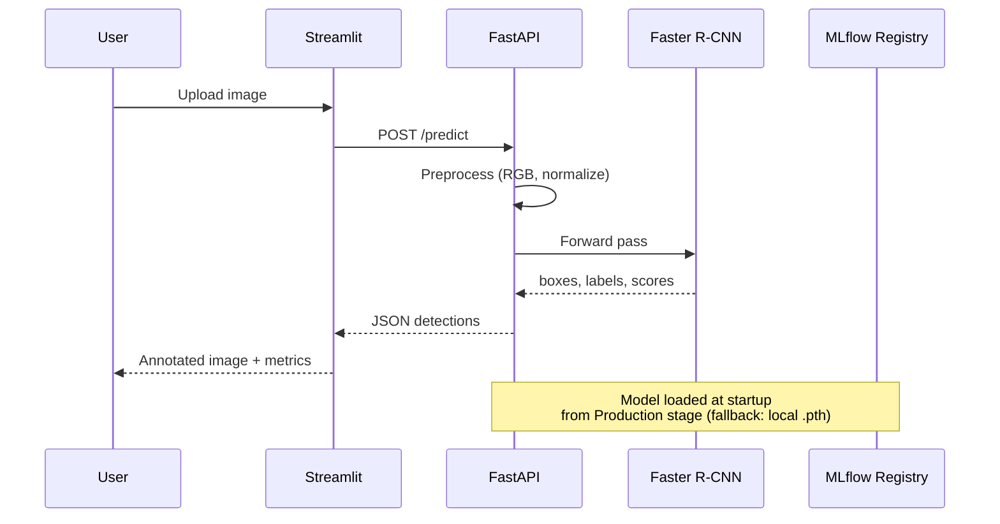

# Face Mask Detection

[](https://github.com/Amirhosseinesbati/FaceMaskDetection/actions/workflows/ml-ci.yml)
[](https://github.com/Amirhosseinesbati/FaceMaskDetection/actions/workflows/cd.yml)
[](https://www.python.org/downloads/)
[](LICENSE)
[](https://pytorch.org/)

End-to-end **computer vision** and **MLOps** project that detects face mask compliance in images. A **Faster R-CNN (ResNet50-FPN v2)** model is trained on the [Kaggle Face Mask Detection dataset](https://www.kaggle.com/datasets/andrewmvd/face-mask-detection), tracked with **MLflow / DagsHub**, orchestrated with **ZenML**, and served through a **FastAPI** backend and **Streamlit** frontend — fully containerized and automated with **GitHub Actions**.

---

## Highlights

| Area | Implementation |
|------|----------------|
| **Task** | Multi-class object detection (bounding boxes) |
| **Model** | Faster R-CNN ResNet50-FPN v2 (transfer learning) |
| **Classes** | `with_mask`, `without_mask`, `mask_weared_incorrect` |
| **Pipeline** | ZenML steps: download → preprocess → train |
| **Experiment tracking** | MLflow on DagsHub |
| **Serving** | FastAPI REST API + Streamlit UI |
| **Deployment** | Docker, Docker Compose, Docker Hub CD |
| **CI/CD** | GitHub Actions (unit tests + smoke training) |
| **Cloud training** | Optional Vast.ai GPU automation |

---

## Architecture



### Request Flow (Inference)



---

## Tech Stack

**Machine Learning:** PyTorch, TorchVision, OpenCV  
**MLOps:** ZenML, MLflow, DagsHub  
**Serving:** FastAPI, Uvicorn, Streamlit  
**Data:** KaggleHub, Pascal VOC XML annotations  
**Infrastructure:** Docker, Docker Compose, Vast.ai  
**Tooling:** uv, pytest, GitHub Actions  

---

## Project Structure

```
FaceMaskDetection/
├── .github/workflows/       # CI (tests + smoke pipeline) & CD (Docker)
├── notebooks/               # Exploratory Jupyter notebook
├── src/
│   ├── preprocessing/       # Kaggle download, zip extraction, validation
│   ├── training/            # Dataset, model, training loop
│   ├── inference/           # Standalone prediction & visualization
│   ├── pipeline/            # ZenML orchestrated end-to-end pipeline
│   ├── serving/             # FastAPI API, Streamlit UI, model loader
│   ├── deploy/              # Vast.ai cloud GPU deployment script
│   └── docker/              # Dockerfile.api, Dockerfile.streamlit
├── tests/                   # Model architecture & forward-pass tests
├── setup_vast.sh            # Cloud instance bootstrap script
├── pyproject.toml           # Dependencies (uv)
└── .env.example             # Environment variable template
```

---

## Getting Started

### Prerequisites

- Python **3.12+**
- [uv](https://docs.astral.sh/uv/) (recommended) or pip
- [Kaggle API credentials](https://www.kaggle.com/docs/api) (for data download)
- Optional: [DagsHub](https://dagshub.com/) account for remote MLflow tracking

### Installation

```bash
git clone https://github.com/Amirhosseinesbati/FaceMaskDetection.git
cd FaceMaskDetection

# Install dependencies
uv sync
```

### Environment Variables

Copy the template and fill in your credentials:

```bash
cp .env.example .env
```

| Variable | Purpose |
|----------|---------|
| `KAGGLE_USERNAME` / `KAGGLE_KEY` | Kaggle dataset download |
| `DAGSHUB_REPO_OWNER` / `DAGSHUB_REPO_NAME` | DagsHub repository |
| `DAGSHUB_USER_TOKEN` | DagsHub / MLflow authentication |
| `DAGSHUB_USERNAME` / `DAGSHUB_REPO_NAME` / `DAGSHUB_TOKEN` | Model serving from registry |
| `VAST_API_KEY` | Cloud GPU training (optional) |

---

## Training

Run the full ZenML pipeline locally:

```bash
# Initialize ZenML (first time only)
uv run zenml init
uv run zenml integration install mlflow -y
uv run zenml experiment-tracker register dagshub_mlflow_tracker --flavor=mlflow
uv run zenml stack register local_stack -o default -a default -e dagshub_mlflow_tracker
uv run zenml stack set local_stack

# Execute pipeline
uv run python src/pipeline/pipeline.py
```

The pipeline executes three cached steps:

1. **Download** — fetches the dataset from Kaggle and archives it to `data/raw/`
2. **Prepare** — extracts images and Pascal VOC XML annotations to `data/processed/`
3. **Train** — fine-tunes Faster R-CNN with mixed-precision (AMP), logs metrics to MLflow, and saves weights to `models/latest_model.pth`

### Default Hyperparameters

| Parameter | Local | CI Smoke Test |
|-----------|-------|---------------|
| Batch size | 16 | 2 |
| Learning rate | 0.005 | 0.005 |
| Epochs | 15 | 1 |
| Optimizer | SGD (momentum 0.9) | SGD |
| Fast dev run | `false` | `true` (2 batches only) |

---

## Inference & Serving

### Standalone Script

```bash
uv run python src/inference/predict.py
```

### FastAPI

```bash
uv run uvicorn src.serving.api:app --host 0.0.0.0 --port 8000 --reload
```

| Endpoint | Method | Description |
|----------|--------|-------------|
| `/` | GET | Service info |
| `/health` | GET | Health check (Docker / K8s) |
| `/predict` | POST | Upload image → JSON detections |
| `/docs` | GET | Swagger UI |

**Example:**

```bash
curl -X POST "http://localhost:8000/predict?threshold=0.5" \
  -H "accept: application/json" \
  -H "Content-Type: multipart/form-data" \
  -F "file=@path/to/image.jpg"
```

### Streamlit UI

```bash
uv run streamlit run src/serving/streamlit_app.py
```

Open **http://localhost:8501** — upload an image, adjust the confidence threshold, and view annotated results with per-class metrics.

---

## Docker

Build and run both services with Docker Compose:

```bash
export DOCKER_USERNAME=your_dockerhub_username
export DAGSHUB_USERNAME=your_username
export DAGSHUB_REPO_NAME=your_repo
export DAGSHUB_TOKEN=your_token

docker compose -f src/docker-compose.yml up --build
```

| Service | Port | Image |
|---------|------|-------|
| API | 8000 | `{DOCKER_USERNAME}/mask-detection-api:latest` |
| Streamlit UI | 8501 | `{DOCKER_USERNAME}/mask-detection-ui:latest` |

Both containers include health checks. The API loads the **Production** model from MLflow Registry, with automatic fallback to `models/latest_model.pth`.

---

## CI/CD

### Continuous Integration (`ml-ci.yml`)

Triggered on push/PR to `main` and `develop`:

- Installs dependencies with **uv**
- Runs **pytest** (model architecture + CPU forward pass)
- Initializes ZenML stack
- Executes a **smoke test** of the full training pipeline (`CI=true`, 2 batches)

### Continuous Deployment (`cd.yml`)

Triggered on push to `main` and version tags (`v*.*.*`):

- Builds and pushes API and Streamlit images to **Docker Hub**
- Uses GitHub Actions cache for faster builds
- Tags: `latest`, commit SHA, semver

### Cloud GPU Training (Optional)

Automate training on a rented Vast.ai GPU:

```bash
uv run python src/deploy/deploy.py
```

The script finds the cheapest matching GPU, provisions a PyTorch CUDA container, runs `setup_vast.sh` (clone repo → install deps → train → log to DagsHub), and can auto-destroy the instance when finished.

---

## Testing

```bash
uv run pytest tests/ -v
```

Tests validate:

- Correct output dimension of the classification head (`num_classes=4`)
- Successful CPU forward pass with dummy input

---

## Model Details

| Property | Value |
|----------|-------|
| Architecture | Faster R-CNN with ResNet50-FPN v2 backbone |
| Pretrained weights | COCO (`DEFAULT`) |
| Input | RGB image, normalized to `[0, 1]` |
| Output | Bounding boxes, class labels, confidence scores |
| Label mapping | `1` with_mask · `2` without_mask · `3` mask_weared_incorrect |

The final classification layer is replaced to match the 3 detection classes (+ background).

---

## License

This project is licensed under the [Apache License 2.0](LICENSE).

---

## Acknowledgments

- Dataset: [Face Mask Detection on Kaggle](https://www.kaggle.com/datasets/andrewmvd/face-mask-detection) by Andrew Mvd
- Built with PyTorch, ZenML, MLflow, FastAPI, and Streamlit
